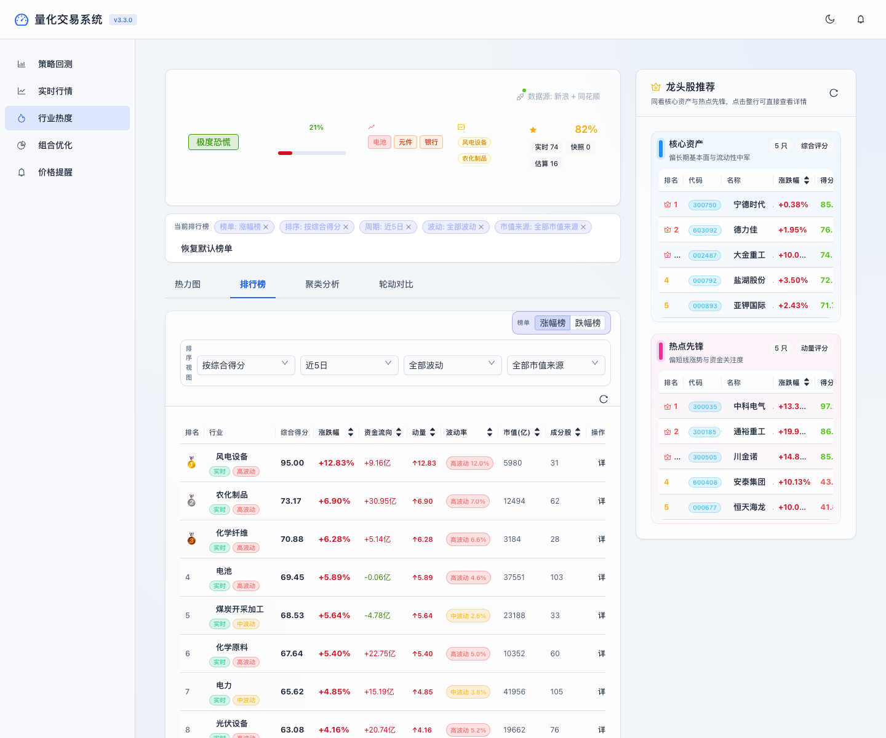
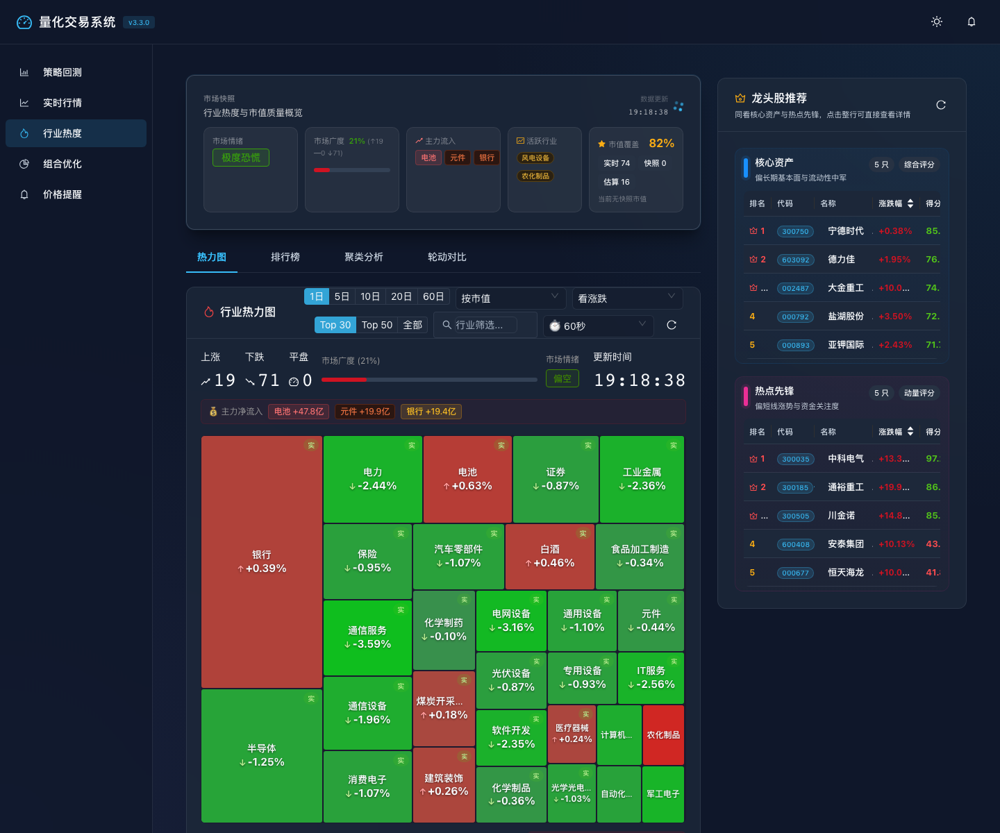
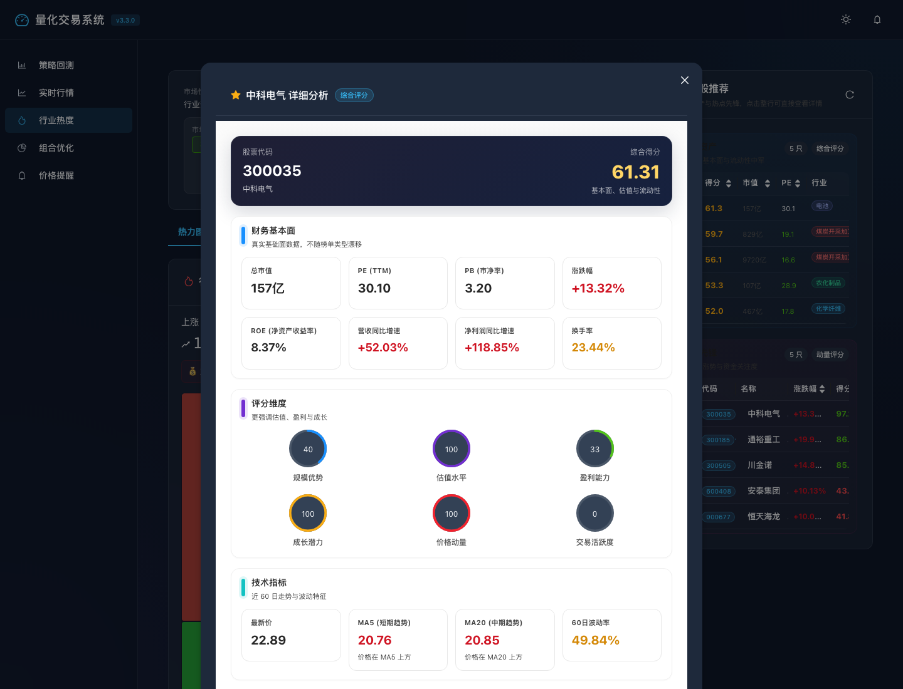

<div align="center">

# 🚀 量化交易系统

**一个基于 FastAPI + React 的量化研究、宏观错误定价分析与跨市场回测平台**

[](https://python.org)
[](https://fastapi.tiangolo.com)
[](https://reactjs.org)
[](LICENSE)
[](CONTRIBUTING.md)

[本地体验](#-本地体验) · [界面预览](#-界面预览) · [功能特性](#-功能特性) · [快速开始](#-快速开始) · [部署说明](docs/DEPLOYMENT.md) · [API 文档](#-api-文档)

</div>

---

## 🧭 本地体验

> 当前不提供公开在线 Demo。请在本地同时启动后端和前端后体验完整功能。


### 30 秒体验

```bash
git clone https://github.com/Leonard-Don/quant-trading-system.git
cd quant-trading-system
./scripts/start_system.sh
```

启动后可直接访问：

- **前端首页**：http://localhost:3000
- **行业热度页**：http://localhost:3000?view=industry
- **实时行情页**：http://localhost:3000?view=realtime
- **上帝视角大屏**：http://localhost:3000?view=godsEye
- **跨市场回测页**：http://localhost:3000?view=backtest&tab=cross-market
- **Swagger API 文档**：http://localhost:8000/docs

### 适合 GitHub 访客的体验路径

1. 打开行业热度页，先看热力图和排行榜
2. 点击龙头股推荐或详情弹窗，查看多维指标分析
3. 打开上帝视角大屏，查看另类数据和宏观因子总览
4. 打开跨市场回测页，加载模板并运行 long/short 组合
5. 打开 Swagger UI，查看后端接口结构

---

## 👀 界面预览

### 行业热度总览



### 行业热力图交互



### 龙头股详情分析



---

## 🌟 项目亮点

- **研究到展示一体化**：从策略回测、实时行情到行业热度分析，提供完整工作流
- **数据可视化友好**：支持热力图、排行榜、详情弹窗等多种交易分析视图
- **宏观错误定价工作流**：已接入另类数据、宏观因子和上帝视角作战大屏
- **跨市场组合回测**：支持 long/short 篮子、模板驱动配置和诊断型回测结果
- **前后端分离架构**：FastAPI 后端 + React 前端，便于独立开发与部署
- **可扩展策略框架**：内置 13 种策略，适合继续扩展和实验

---

## ✨ 功能特性

### 📊 行情分析
- **行业热度追踪** — 实时计算行业热度评分，识别资金流向
- **龙头股分析** — 多维度评分筛选各行业龙头标的
- **实时报价** — 多平台数据聚合，4 平台行情整合
- **历史数据查询** — 支持自定义周期历史行情回溯
- **定价研究** — 提供资产定价、估值与定价偏差研究入口

### 🧪 策略回测
- **13 种内置策略** — 覆盖趋势、动量、均值回归等主流策略
- **LSTM 深度学习预测** — 基于神经网络的价格预测策略
- **情绪分析策略** — 结合市场情绪的量化信号
- **完整回测报告** — PDF/HTML 格式导出，含夏普率、最大回撤等指标
- **跨市场回测** — 支持 US Stock / ETF / Commodity Futures 的 long/short 组合回测
- **真实度诊断** — 输出数据对齐、换手、成本拖累、持仓周期和 hedge ratio 等指标

### 💼 组合管理
- **投资组合优化** — Markowitz 均值方差优化
- **配对交易** — 统计套利策略支持
- **风险管理** — 仓位控制、止损止盈自动化

### 🌍 宏观与另类数据
- **另类数据管线** — 政策雷达、产业链信号、宏观高频信号统一纳管
- **宏观因子库** — 官僚摩擦、技术稀释、基荷错配等错误定价因子
- **GodEye Dashboard** — 面向研究与演示的宏观作战总览页

### 🤖 AI / ML 支持
- **LSTM 价格预测**
- **机器学习分类策略**
- **情绪信号提取**

---

## 🚀 快速开始

### 环境要求

- Python 3.9+
- Node.js 16+
- npm 8+

### 一键启动（推荐）

```bash
# 1. 克隆项目
git clone https://github.com/Leonard-Don/quant-trading-system.git
cd quant-trading-system

# 2. 安装依赖并启动
./scripts/start_system.sh
```

启动后访问：
- 前端界面：http://localhost:3000
- 行业热度：http://localhost:3000?view=industry
- 上帝视角：http://localhost:3000?view=godsEye
- 跨市场回测：http://localhost:3000?view=backtest&tab=cross-market
- API 文档：http://localhost:8000/docs

### 分步启动（开发调试）

```bash
# 安装 Python 依赖
pip install -r requirements.txt

# 启动后端
python scripts/start_backend.py

# 新终端：安装并启动前端
cd frontend && npm install && npm start
```

---

## 🏗️ 系统架构

```
quant-trading-system/
├── backend/          # 后端服务
│   ├── api/          # FastAPI 路由与接口
│   └── services/     # 业务逻辑层
├── frontend/         # React 前端应用
│   └── src/
│       ├── components/   # 可复用组件
│       └── pages/        # 页面视图
├── src/              # 核心算法库
│   ├── strategy/     # 单资产策略实现
│   ├── analytics/    # 分析与因子模块
│   ├── data/         # 市场数据与另类数据
│   ├── backtest/     # 单资产 / 跨市场回测引擎
│   ├── trading/      # 交易与跨市场资产建模
│   └── utils/        # 工具函数
├── scripts/          # 启动/管理脚本
├── tests/            # 单元/集成/E2E 测试
└── docs/             # 项目文档
```

**技术栈**

| 层级 | 技术 |
|------|------|
| 后端框架 | FastAPI + Uvicorn |
| 前端框架 | React 18 |
| 数据获取 | yfinance、AKShare、BaoStock |
| AI/ML | PyTorch (LSTM) + scikit-learn |
| 可视化 | Ant Design + Recharts |
| 测试 | pytest + Playwright |
| 文档 | OpenAPI / Swagger |

---

## 📈 可用策略

| 策略 ID | 策略名称 | 类型 |
|---------|---------|------|
| `moving_average` | 移动平均 | 趋势跟踪 |
| `rsi` | 相对强弱指标 | 动量 |
| `bollinger_bands` | 布林带 | 均值回归 |
| `macd` | MACD | 趋势 + 动量 |
| `mean_reversion` | 均值回归 | 统计套利 |
| `vwap` | 成交量加权均价 | 量价 |
| `momentum` | 动量策略 | 动量 |
| `stochastic` | 随机指标 | 超买超卖 |
| `atr_trailing_stop` | ATR 移动止损 | 风险管理 |
| `lstm_prediction` | LSTM 深度学习 | AI/ML |
| `pairs_trading` | 配对交易 | 统计套利 |
| `sentiment_analysis` | 情绪分析 | 另类数据 |
| `portfolio_optimization` | 投资组合优化 | 组合管理 |

---

## 📖 API 文档

启动后端后访问：

- **Swagger UI**：http://localhost:8000/docs
- **ReDoc**：http://localhost:8000/redoc
- **详细参考**：[docs/API_REFERENCE.md](docs/API_REFERENCE.md)

### 近期新增接口

- `GET /alt-data/snapshot`：另类数据作战快照
- `GET /macro/overview`：宏观错误定价总览
- `GET /cross-market/templates`：跨市场回测模板
- `POST /cross-market/backtest`：跨市场 long/short 组合回测

---

## 🧪 运行测试

```bash
# 单元测试
python scripts/run_tests.py --unit

# 集成测试
python scripts/run_tests.py --integration

# E2E 测试（需先启动前后端）
python scripts/run_tests.py --e2e-industry
```

---

## 🗺️ 路线图

- [x] FastAPI 后端 + React 前端
- [x] 13 种量化策略
- [x] 行业热度 & 龙头股分析
- [x] LSTM AI 策略
- [x] 投资组合优化
- [x] 另类数据统一管线
- [x] 宏观错误定价因子库
- [x] GodEye 上帝视角大屏
- [x] 跨市场 long/short 回测 MVP
- [x] 跨市场回测真实度诊断（对齐 / turnover / cost drag / OLS hedge）
- [ ] 实盘交易接口对接
- [ ] 多用户 / SaaS 版本
- [ ] 移动端适配
- [ ] 更多数据源集成
- [ ] 策略参数自动优化（网格搜索 / 贝叶斯优化）

---

## 🤝 参与贡献

欢迎 PR 和 Issue！

1. Fork 本仓库
2. 创建特性分支 (`git checkout -b feature/AmazingFeature`)
3. 提交修改 (`git commit -m 'Add some AmazingFeature'`)
4. 推送分支 (`git push origin feature/AmazingFeature`)
5. 发起 Pull Request

---

## ⚠️ 免责声明

本系统**仅供学习与研究使用**，不构成任何投资建议。量化交易存在风险，过往回测表现不代表未来收益。使用者需自行承担投资决策的全部责任。

---

## 📄 License

本项目采用 [MIT License](LICENSE) 开源协议。

---

<div align="center">
如果这个项目对你有帮助，欢迎点个 ⭐ Star！
</div>
