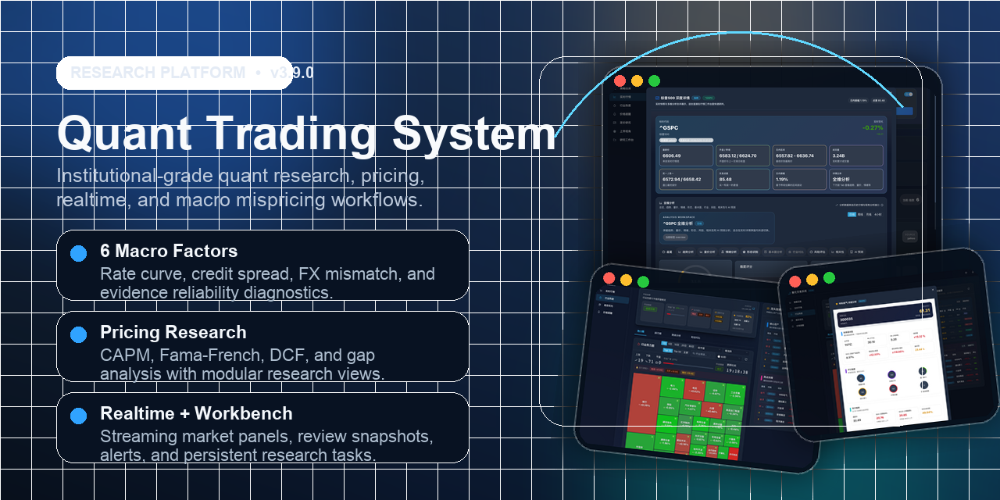
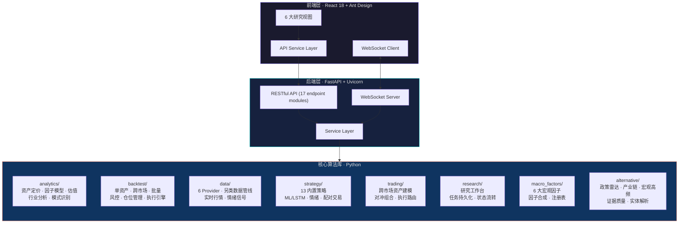
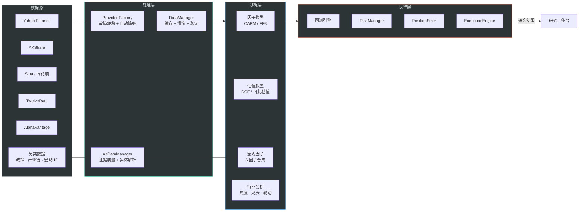
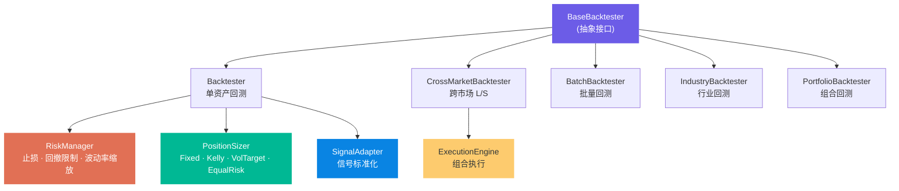
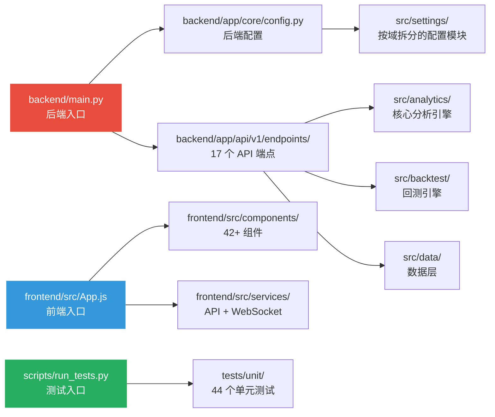

<div align="center">

# 量化交易系统

**一个基于 FastAPI + React 的量化研究、宏观错误定价、资产定价研究与跨市场回测平台**  
*An institutional-grade quantitative research framework featuring macro mispricing arbitrage, alternative data pipelines, and advanced asset pricing models.*

**当前版本：`v3.9.0`** · [查看完整更新日志](docs/CHANGELOG.md)

[](https://python.org)
[](https://fastapi.tiangolo.com)
[](https://reactjs.org)
[](https://github.com/Leonard-Don/quant-trading-system/stargazers)
[](https://github.com/Leonard-Don/quant-trading-system/network/members)
[](https://github.com/Leonard-Don/quant-trading-system/issues)
[](https://github.com/Leonard-Don/quant-trading-system/releases/latest)
[](https://github.com/Leonard-Don/quant-trading-system/actions/workflows/ci.yml)
[](LICENSE)
[](CONTRIBUTING.md)

<br />

> **110,000+** 行代码 · **60+** 自动化测试 · **6** 大数据提供器 · **13** 种内置策略 · **6** 大研究视图

[本地体验](#-本地体验) · [核心工作流](#-核心工作流) · [系统架构](#️-系统架构) · [功能特性](#-功能特性) · [快速开始](#-快速开始) · [API 文档](#-api-文档) · [路线图](#️-路线图) · [参与贡献](#-参与贡献)

</div>

---

## 🧭 本地体验

> 当前不提供公开在线 Demo。请在本地同时启动后端和前端后体验完整功能。


### 30 秒体验

```bash
git clone https://github.com/Leonard-Don/quant-trading-system.git
cd quant-trading-system
./scripts/start_system.sh
```

启动后可直接访问：

| 页面 | 地址 | 说明 |
|------|------|------|
| 📊 策略回测 | http://localhost:3000 | 默认首页，单资产回测与结果展示 |
| 📈 实时行情 | http://localhost:3000?view=realtime | 多平台行情聚合 + 深度详情分析 |
| 🔥 行业热度 | http://localhost:3000?view=industry | 热力图、排行榜、龙头股分析 |
| 💰 定价研究 | http://localhost:3000?view=pricing | CAPM / FF3 / DCF / Gap Analysis |
| 🛰️ 上帝视角 | http://localhost:3000?view=godsEye | 宏观因子、另类数据、跨市场总览 |
| 📂 研究工作台 | http://localhost:3000?view=workbench | 任务持久化、状态流转、重开研究页 |
| 🔄 跨市场回测 | http://localhost:3000?view=backtest&tab=cross-market | Long/Short 组合跨市场回测 |
| 📖 API 文档 | http://localhost:8000/docs | Swagger UI 交互式文档 |

### 推荐体验路径

1. **行业热度页** → 查看热力图和行业排行榜，了解当前市场温度
2. **实时行情页** → 点击指数/美股卡片，进入深度详情看趋势、量价、情绪和相关性
3. **定价研究页** → 输入 `AAPL` 或 `NVDA`，查看因子暴露、估值偏差和驱动因素
4. **上帝视角大屏** → 总览宏观因子、另类数据共振与政策雷达
5. **跨市场回测页** → 加载模板并运行 long/short 组合，查看真实度诊断
6. **研究工作台** → 从上述页面保存 research task，在工作台统一跟踪

---

## 🎯 核心工作流

本项目的核心价值在于将量化研究从"单点工具"升级为"研究线索 → 分析验证 → 回测执行 → 工作台沉淀"的闭环。以下是四条最具代表性的工作流：


| 工作流 | 输入 | 核心引擎 | 输出 |
|--------|------|----------|------|
| **定价研究** | 股票代码 | CAPM / FF3 因子模型 + DCF / 可比估值 | 公允价值区间、定价偏差、偏差驱动因素 |
| **宏观错误定价** | 政策雷达、产业链信号、宏观高频数据 | 6 大宏观因子 + 证据质量引擎 | GodEye Dashboard 可视化总览 |
| **跨市场 Long/Short** | 多头篮子 + 空头篮子 | 跨市场回测 + 对齐诊断 | 换手率、成本拖累、hedge ratio、真实度报告 |
| **研究工作台** | GodEye / 定价 / 回测研究线索 | 任务卡持久化 + 状态机 | 可追踪、可重开、可对比的研究任务流 |

---

## 👀 界面预览

<div align="center">
  
  <br />
  <sub>GitHub 仓库分享图 · 聚合实时行情、行业研究、定价分析与研究工作台的核心界面</sub>
</div>

<br />

<table>
  <tr>
    <td align="center" width="50%">
      <br />
      <b>实时行情深度详情</b><br />
      <sub>实时快照 + 全维分析（趋势、量价、情绪、形态、风险、相关性、AI 预测）</sub>
    </td>
    <td align="center" width="50%">
      <br />
      <b>行业热度总览</b><br />
      <sub>行业热度评分、资金流向、板块轮动追踪</sub>
    </td>
  </tr>
  <tr>
    <td align="center" width="50%">
      <br />
      <b>行业热力图交互</b><br />
      <sub>Treemap 可视化，支持市值/涨跌幅/成交量等维度切换</sub>
    </td>
    <td align="center" width="50%">
      <br />
      <b>龙头股详情分析</b><br />
      <sub>多维度综合评分体系，覆盖基本面、技术面、资金面</sub>
    </td>
  </tr>
</table>

---

## 🏗️ 系统架构

### 整体架构



### 项目目录结构

```
quant-trading-system/
├── backend/                    # 后端服务
│   ├── main.py                 # FastAPI 主应用入口
│   └── app/
│       ├── api/v1/endpoints/   # 17 个 API 端点模块
│       ├── core/               # 配置、错误处理、中间件
│       ├── schemas/            # Pydantic 请求/响应模型
│       ├── services/           # 实时告警、偏好、复盘、交易流
│       └── websocket/          # WebSocket 连接管理与路由
├── frontend/                   # React 前端应用
│   └── src/
│       ├── components/         # 42+ React 组件（含 9 个子模块目录）
│       ├── hooks/              # 4 个自定义 Hook（实时行情、偏好、诊断）
│       ├── services/           # API 调用 + WebSocket 客户端
│       ├── contexts/           # 主题上下文
│       ├── i18n/               # 国际化支持
│       └── utils/              # 研究上下文、工具函数
├── src/                        # 核心算法库（41,000+ 行）
│   ├── analytics/              # 资产定价、估值、行业分析、因子模型
│   │   ├── macro_factors/      # 6 大宏观错误定价因子
│   │   ├── asset_pricing.py    # CAPM / Fama-French
│   │   ├── valuation_model.py  # DCF / 可比估值
│   │   └── pricing_gap_analyzer.py  # 定价偏差综合分析
│   ├── backtest/               # 回测引擎（7 个子模块）
│   │   ├── base_backtester.py  # 抽象基类接口
│   │   ├── backtester.py       # 单资产回测核心
│   │   ├── cross_market_backtester.py  # 跨市场 L/S 回测
│   │   ├── risk_manager.py     # 风控（止损、回撤限制、波动率缩放）
│   │   ├── position_sizer.py   # 仓位管理（Kelly / Vol Target / Equal Risk）
│   │   ├── execution_engine.py # 组合执行引擎
│   │   └── signal_adapter.py   # 信号标准化适配器
│   ├── data/                   # 数据层
│   │   ├── providers/          # 6 大数据提供器（Yahoo, AKShare, Sina, 12Data, AV, Commodity）
│   │   ├── alternative/        # 另类数据管线（政策/产业链/宏观高频）
│   │   └── realtime_manager.py # 实时行情管理
│   ├── strategy/               # 13 种内置策略
│   ├── trading/                # 交易执行与跨市场建模
│   │   └── cross_market/       # 资产宇宙、策略、对冲组合、执行路由
│   ├── research/               # 研究工作台核心逻辑
│   ├── reporting/              # 报告生成（PDF / HTML / CSV / Excel）
│   └── utils/                  # 缓存、配置、性能监控、验证
├── tests/                      # 60+ 测试文件（11,000+ 行）
│   ├── unit/                   # 44 个单元测试
│   ├── integration/            # 集成测试
│   ├── e2e/                    # 端到端测试（Playwright）
│   └── manual/                 # 手工/调试测试
├── scripts/                    # 运维脚本
│   ├── start_system.sh         # 一键启动（前后端 + 健康检查）
│   ├── stop_system.sh          # 一键停止
│   ├── run_tests.py            # 测试入口（unit/integration/e2e）
│   ├── health_check.py         # 健康检查
│   └── dev_tools.py            # 开发工具（lint / format / check）
└── docs/                       # 文档
    ├── API_REFERENCE.md        # API 参考（含 Postman Collection）
    ├── PROJECT_STRUCTURE.md    # 项目结构详解
    ├── TESTING_GUIDE.md        # 测试指南
    ├── DEPLOYMENT.md           # 部署说明
    └── openapi.json            # OpenAPI 规范
```

### 技术栈

| 层级 | 技术 | 说明 |
|------|------|------|
| 后端框架 | FastAPI + Uvicorn | 异步 RESTful API，自动 OpenAPI 文档 |
| 前端框架 | React 18 + Ant Design 5 | 懒加载 + 暗色主题 + 响应式布局 |
| 实时通信 | WebSocket | 行情推送 + 交易流广播 |
| 数据获取 | yfinance · AKShare · Sina · TwelveData · AlphaVantage | 6 大数据源 + 故障转移 |
| AI/ML | PyTorch (LSTM) + scikit-learn | 价格预测 + 分类策略 |
| 图表可视化 | Recharts + Ant Design Charts | K 线图 · 热力图 · 雷达图 · 走势图 |
| 测试框架 | pytest + Playwright | 单元 / 集成 / E2E 全链路覆盖 |
| 国际化 | i18n (中/英文) | 前端多语言支持 |
| API 文档 | OpenAPI / Swagger / ReDoc | 在线交互 + Postman Collection |

### 数据流架构



---

## ✨ 功能特性

### 📊 行情分析

| 功能 | 说明 |
|------|------|
| **实时行情聚合** | 6 大数据源聚合，WebSocket 实时推送，支持 A 股 / 美股 / ETF / 商品期货 |
| **深度详情分析** | 8 维联动分析：总览 · 趋势 · 量价 · 情绪 · 形态 · 风险 · 相关性 · AI 预测 |
| **行业热度追踪** | 实时行业热度评分，Treemap 热力图，支持多维度切换 |
| **龙头股分析** | 多维度综合评分体系（基本面 + 技术面 + 资金面） |
| **K 线图表** | 多周期切换（日 / 周 / 月 / 4 小时），暗色模式优化 |
| **价格提醒** | 条件筛选 · 批量启停 / 重置 / 删除，跨标的对比记忆 |

### 💵 资产定价研究

| 模型 | 输入 | 输出 |
|------|------|------|
| **CAPM** | 股票收益率 + 市场基准 | Alpha · Beta · R² · 特质风险 |
| **Fama-French 三因子** | 股票收益率 + SMB / HML | 市场 · 规模 · 价值因子暴露 |
| **DCF 估值** | 财务数据 + 增长假设 | 两阶段内在价值 |
| **可比估值法** | 行业可比公司 | P/E · Forward P/E · P/B 公允价值参考 |
| **Gap Analysis** | 上述模型合成 | 市价 vs 公允价值区间 · 定价偏差 · 驱动因素 |
| **基准因子快照** | Fama-French 因子数据 | 近期因子统计摘要 |

### 🌍 宏观错误定价引擎

**6 大宏观因子**：

| 因子 | 代码 | 信号来源 |
|------|------|---------|
| 官僚摩擦 | `BureaucraticFrictionFactor` | 政策传导延迟与执行阻力 |
| 技术稀释 | `TechDilutionFactor` | 技术创新对传统行业的价值侵蚀 |
| 基荷错配 | `BaseloadMismatchFactor` | 能源/基础设施供需结构性失衡 |
| 信用利差压力 | `CreditSpreadStressFactor` | 信用市场风险溢价异常 |
| 汇率错配 | `FXMismatchFactor` | 跨市场汇率风险传导 |
| 利率曲线压力 | `RateCurvePressureFactor` | 收益率曲线形态异常信号 |

**另类数据管线**（3 大子系统）：

```
alternative/
├── policy_radar/      # 政经语义雷达：官方 feed + 正文抓取 + source health 诊断
├── supply_chain/      # 产业链暗网爬虫：产业链上下游信号采集
└── macro_hf/          # 全球宏观高频接口：高频经济指标实时接入
```

证据质量引擎支持：实体统一、来源可信度、冲突/漂移/断流/跨源确认、一致度、反转前兆与因子共振判断。

### 🧪 策略回测

**回测引擎架构**（Phase 2 升级后）：



**13 种内置策略**：

| 策略 ID | 名称 | 类型 |
|---------|------|------|
| `moving_average` | 移动平均 | 趋势跟踪 |
| `rsi` | 相对强弱指标 | 动量 |
| `bollinger_bands` | 布林带 | 均值回归 |
| `macd` | MACD | 趋势 + 动量 |
| `mean_reversion` | 均值回归 | 统计套利 |
| `vwap` | 成交量加权均价 | 量价 |
| `momentum` | 动量策略 | 动量 |
| `stochastic` | 随机指标 | 超买超卖 |
| `atr_trailing_stop` | ATR 移动止损 | 风险管理 |
| `lstm_prediction` | LSTM 深度学习 | AI/ML |
| `pairs_trading` | 配对交易 | 统计套利 |
| `sentiment_analysis` | 情绪分析 | 另类数据 |
| `portfolio_optimization` | 投资组合优化 | 组合管理 |

**跨市场回测能力**：

- 支持 US Stock / ETF / Commodity Futures 的 long/short 组合
- 构造方式：`equal_weight` / `ols_hedge`
- 诊断输出：数据对齐 · 换手率 · 成本拖累 · 持仓周期 · hedge ratio
- 模板驱动配置，支持主题偏置与自动降级

### 💼 GodEye 上帝视角

面向研究与演示的宏观作战总览，包含：

- **宏观因子面板** — 6 大因子实时状态与合成评分
- **政策时间线** — 政策源 feed + source health 监控
- **产业链热力图** — 供应链信号可视化
- **跨市场总览** — 多市场联动分析
- **风险溢价雷达** — 多维风险可视化
- **研究任务智能推送** — 共振驱动、自动降级、核心腿受压等优先级排序

### 📂 研究工作台

- **任务持久化** — 从 GodEye / 定价研究 / 跨市场回测保存研究线索
- **状态机流转** — `new → in_progress → review → done` 全生命周期管理
- **快照对比** — 支持 recommendation · allocation · bias · driver 等维度版本对比
- **Deep Link 重开** — 从工作台一键重开原始研究页

---

## 🚀 快速开始

### 环境要求

- Python 3.9+
- Node.js 16+
- npm 8+

### 一键启动（推荐）

```bash
# 1. 克隆项目
git clone https://github.com/Leonard-Don/quant-trading-system.git
cd quant-trading-system

# 2. 安装依赖并启动（含健康检查）
./scripts/start_system.sh
```

### 分步启动（开发调试）

```bash
# 后端
pip install -r requirements-dev.txt
python scripts/start_backend.py

# 前端（新终端）
cd frontend && npm install && npm start
```

### 生产构建

```bash
pip install -r requirements.txt
cd frontend && npm install && npm run build && cd ..
API_RELOAD=false python backend/main.py
```

### 环境变量

复制 `.env.example` 为 `.env`，按需修改。常用变量：

| 变量 | 默认值 | 说明 |
|------|--------|------|
| `API_HOST` | `127.0.0.1` | 后端监听地址 |
| `API_PORT` | `8000` | 后端监听端口 |
| `API_RELOAD` | `true` | 热重载（开发模式） |
| `DATA_CACHE_SIZE` | `100` | 数据缓存条目数 |
| `CACHE_TTL` | `3600` | 缓存过期时间（秒） |
| `REACT_APP_API_URL` | *(auto)* | 前端 API 地址 |
| `MAX_WORKERS` | `4` | 并发线程数 |

完整配置请参考 [`.env.example`](.env.example)，配置模块映射见 [`src/settings/`](src/settings/)。

### 依赖说明

- **`requirements.txt`** — 运行时最小依赖，适合部署
- **`requirements-dev.txt`** — 开发 + 测试 + 代码质量工具，包含运行时依赖

---

## 📖 API 文档

启动后端后访问：

- **Swagger UI**：http://localhost:8000/docs
- **ReDoc**：http://localhost:8000/redoc
- **详细参考**：[docs/API_REFERENCE.md](docs/API_REFERENCE.md)
- **Postman Collection**：[docs/postman_collection.json](docs/postman_collection.json)

### API 端点概览

| 模块 | 端点示例 | 说明 |
|------|---------|------|
| 行业分析 | `GET /industry/heat-scores` | 行业热度评分 |
| 实时行情 | `GET /realtime/quotes` | 多平台行情聚合 |
| 定价研究 | `POST /pricing/factor-model` | CAPM / FF3 因子分析 |
| 估值分析 | `POST /pricing/valuation` | DCF + 可比估值 |
| 偏差分析 | `POST /pricing/gap-analysis` | 定价偏差综合分析 |
| 另类数据 | `GET /alt-data/snapshot` | 另类数据作战快照 |
| 宏观因子 | `GET /macro/overview` | 宏观错误定价总览 |
| 跨市场回测 | `POST /cross-market/backtest` | Long/Short 组合回测 |
| 跨市场模板 | `GET /cross-market/templates` | 回测模板管理 |
| 研究工作台 | `GET /research-workbench/tasks` | 任务列表 |
| 研究工作台 | `POST /research-workbench/tasks` | 保存研究任务 |
| 策略回测 | `POST /backtest/run` | 单资产策略回测 |
| WebSocket | `ws://localhost:8000/ws/quotes` | 实时行情推送 |
| WebSocket | `ws://localhost:8000/ws/trades` | 交易流广播 |

---

## 🧪 运行测试

```bash
# 运行全部测试（unit + integration + system）
python scripts/run_tests.py

# 仅单元测试
python scripts/run_tests.py --unit

# 仅集成测试
python scripts/run_tests.py --integration

# E2E 测试（需先启动前后端）
python scripts/run_tests.py --e2e-industry

# 指定模块定向测试
python3 -m pytest tests/unit/test_cross_market_backtester.py tests/unit/test_asset_pricing.py -q
python3 -m pytest tests/unit/test_research_workbench.py -q
python3 -m pytest tests/unit/test_risk_manager.py tests/unit/test_position_sizer.py -q
```

更多测试分层和前置条件见 [docs/TESTING_GUIDE.md](docs/TESTING_GUIDE.md)。

---

## 🧭 推荐阅读路径

面向**新贡献者**或**代码审查者**，建议按以下顺序阅读关键文件：



| 阅读目标 | 推荐文件 |
|----------|---------|
| 理解后端入口 | [`backend/main.py`](backend/main.py) |
| 理解配置体系 | [`backend/app/core/config.py`](backend/app/core/config.py) → [`src/settings/`](src/settings/) |
| 理解前端结构 | [`frontend/src/App.js`](frontend/src/App.js) |
| 理解核心引擎 | [`src/analytics/`](src/analytics/) · [`src/backtest/`](src/backtest/) |
| 理解数据流 | [`src/data/providers/`](src/data/providers/) · [`src/data/alternative/`](src/data/alternative/) |
| 理解测试体系 | [`scripts/run_tests.py`](scripts/run_tests.py) · [`docs/TESTING_GUIDE.md`](docs/TESTING_GUIDE.md) |
| 部署与运维 | [`docs/DEPLOYMENT.md`](docs/DEPLOYMENT.md) · [`scripts/start_system.sh`](scripts/start_system.sh) |

---

## 🚀 最新更新（v3.9.0）

> 完整更新日志见 [CHANGELOG.md](docs/CHANGELOG.md)

- **宏观错误定价升级为 6 因子可靠度引擎** — 新增利率曲线压力、信用利差压力与汇率错配，并对冲突、覆盖、时滞、漂移、反转前兆、政策源健康度给出可解释诊断
- **定价研究完成模块化拆分** — 资产定价、估值、Gap Analysis 与筛选/同行对比支撑层分离，研究说明与结果区块更稳定，也更便于继续扩展
- **实时与工作台结构重构** — 实时行情面板拆出派生状态、元数据与分享模板，研究工作台与 GodEye 进一步组件化，便于维护并降低回归风险
- **行业页进入可持久化配置阶段** — 自选行业、保存视图与提醒阈值现可导入/导出并回写后端，行业成分股构建也补上流式状态反馈

---

## 🗺️ 路线图

### ✅ 已完成

- [x] FastAPI 后端 + React 前端
- [x] 13 种量化策略 + LSTM AI 策略
- [x] 行业热度 & 龙头股分析
- [x] 投资组合优化（Markowitz）
- [x] 另类数据统一管线（政策雷达 / 产业链 / 宏观高频）
- [x] 宏观错误定价因子库（6 因子 + 合成 + 注册表）
- [x] 证据质量引擎（实体解析 / 来源可信度 / 冲突检测）
- [x] GodEye 上帝视角大屏
- [x] 资产定价研究（CAPM / FF3 / DCF / Gap Analysis）
- [x] 跨市场 Long/Short 回测 + 真实度诊断
- [x] 研究工作台（任务持久化 / 状态流转 / Deep Link）
- [x] 回测引擎 Phase 2（BaseBacktester / RiskManager / PositionSizer / ExecutionEngine）
- [x] WebSocket 实时推送（行情 + 交易流）
- [x] 研究运营闭环（动作姿势 / 自动降级 / 共振驱动）

### 🔮 规划中

- [ ] 实盘交易接口对接
- [ ] 多用户 / SaaS 版本
- [ ] 移动端适配
- [ ] 更多数据源集成
- [ ] 策略参数自动优化（网格搜索 / 贝叶斯优化）

---

## 🤝 GitHub 协作

- **最新发布**：[Releases](https://github.com/Leonard-Don/quant-trading-system/releases/latest)
- **CI 状态**：[GitHub Actions](https://github.com/Leonard-Don/quant-trading-system/actions/workflows/ci.yml)
- **提问与反馈**：[Issues](https://github.com/Leonard-Don/quant-trading-system/issues)
- **贡献入口**：[CONTRIBUTING.md](CONTRIBUTING.md)
- **安全披露**：[SECURITY.md](SECURITY.md)

---

## 🤝 参与贡献

欢迎 PR 和 Issue！

1. Fork 本仓库
2. 创建特性分支 (`git checkout -b feature/AmazingFeature`)
3. 提交修改 (`git commit -m 'Add some AmazingFeature'`)
4. 推送分支 (`git push origin feature/AmazingFeature`)
5. 发起 Pull Request

---

## ⚠️ 免责声明

本系统**仅供学习与研究使用**，不构成任何投资建议。量化交易存在风险，过往回测表现不代表未来收益。使用者需自行承担投资决策的全部责任。

---

## 📄 License

本项目采用 [MIT License](LICENSE) 开源协议。

---

<div align="center">

如果这个项目对你有帮助，欢迎点个 ⭐ Star！

**文档更新时间**：2026-04-02

</div>
