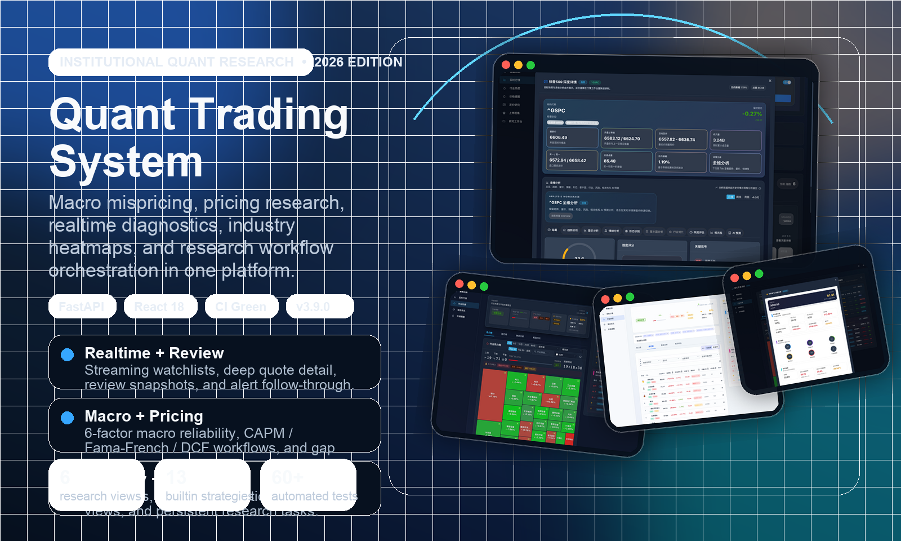
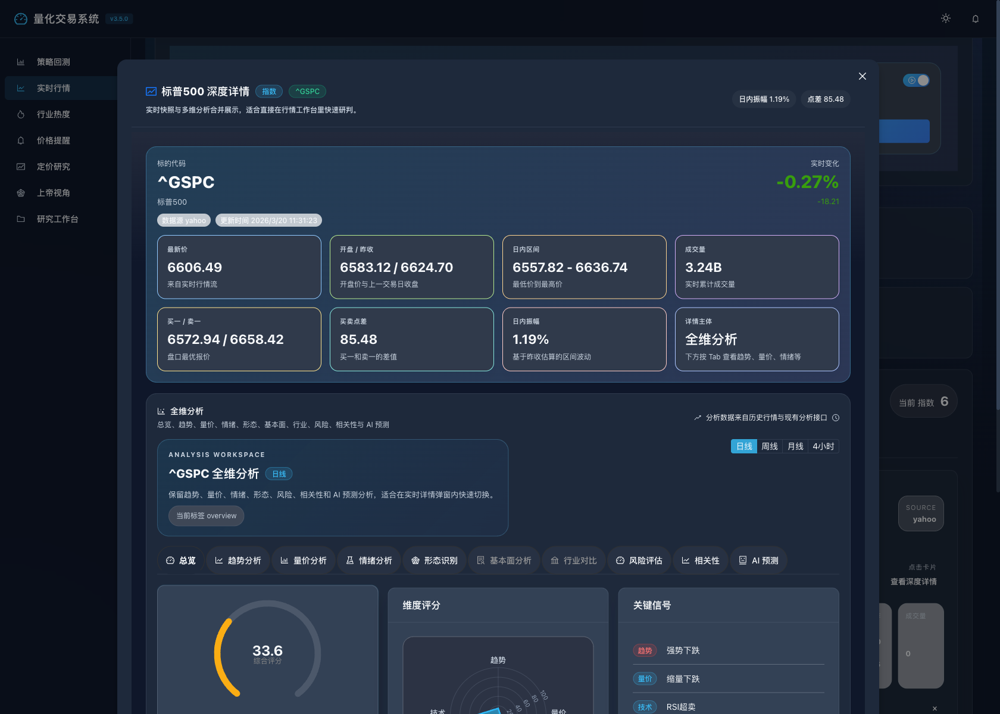

<div align="center">

# quant-trading-system

**一个基于 FastAPI + React 的量化交易研究平台，聚焦 `策略回测`、`实时行情`、`行业热度` 三大工作区。**  
*A quantitative research workspace focused on backtesting, realtime market monitoring, and industry heat analysis.*

**当前版本：`v5.0.0`** · [查看更新日志](docs/CHANGELOG.md)

[](https://python.org)
[](https://fastapi.tiangolo.com)
[](https://reactjs.org)
[](https://github.com/Leonard-Don/quant-trading-system/actions/workflows/ci.yml)
[](https://github.com/Leonard-Don/quant-trading-system/releases/latest)
[](LICENSE)

<br />

> 本地优先 · 三大工作区 · 可独立运行 · 自带浏览器回归验证

[本地体验](#-本地体验) · [核心能力](#-核心能力) · [界面预览](#-界面预览) · [快速开始](#-快速开始) · [测试验证](#-测试验证) · [API 文档](#-api-文档) · [更新日志](docs/CHANGELOG.md)

</div>

---

## 📌 仓库定位

这个仓库是一个独立维护的量化研究项目，围绕三块核心工作区展开：

| 模块 | 说明 |
|------|------|
| 📊 策略回测 | 单资产 / 跨市场 / 批量 / Walk-Forward 回测引擎 |
| 📈 实时行情 | 多市场实时行情聚合、WebSocket 推送、提醒与复盘 |
| 🔥 行业热度 | 行业热力图、排行榜、龙头股分析与轮动观察 |

这意味着：

- 当前仓的前端主入口是 `backtest / realtime / industry`
- 当前仓的后端接口围绕 `/backtest/*`、`/realtime/*`、`/industry/*`、`/cross-market/*` 等能力展开
- 项目可以独立 clone、安装、启动和发布，不依赖其他 sibling repo

### 🎯 这个仓适合谁

- 想直接拿到一个能跑起来的量化研究工作台，而不是只拿到一个算法库
- 想把 `策略回测`、`实时行情`、`行业热度` 放在同一个前后端项目里联动验证
- 想优先依赖真实页面和浏览器回归来确认功能，而不是只看接口或静态图

### 🔎 GitHub 首页建议先看

| 如果你想先看 | 建议入口 |
|------|------|
| 这个仓实际长什么样 | [本地体验](#-本地体验) + [界面预览](#-界面预览) |
| 怎么最快启动 | [快速开始](#-快速开始) |
| 提供了哪些接口与模块 | [API 文档](#-api-文档) + [项目结构](docs/PROJECT_STRUCTURE.md) |
| 最近版本改了什么 | [更新日志](docs/CHANGELOG.md) + [Release Notes](docs/releases/v5.0.0.md) |

---

## 🧭 本地体验

> 当前不提供公开在线 Demo。请在本地同时启动前后端后体验完整功能。

### 最快启动

```bash
cp .env.example .env
./scripts/start_system.sh
```

启动成功后直接访问：

- `http://localhost:3000` 查看策略回测
- `http://localhost:3000?view=realtime` 查看实时行情
- `http://localhost:3000?view=industry` 查看行业热度

<div align="center">
  
  <br />
  <sub>当前版本聚焦策略回测、实时行情与行业热度三块能力</sub>
</div>

<br />

<div align="center">
  
  <br />
  <sub>本地启动后的主要页面流转与交互预览</sub>
</div>

### 启动后可访问

| 页面 | 地址 | 说明 |
|------|------|------|
| 📊 策略回测 | `http://localhost:3000` | 单资产回测、历史记录、对比、组合优化、跨市场回测 |
| 📈 实时行情 | `http://localhost:3000?view=realtime` | 多市场行情聚合、提醒、复盘与深度详情 |
| 🔥 行业热度 | `http://localhost:3000?view=industry` | 热力图、排行榜、龙头股分析、轮动观察 |
| 📖 API 文档 | `http://localhost:8000/docs` | Swagger UI 交互式文档 |

### 推荐体验路径

1. 先进入 **行业热度**，查看热力图和排行榜，建立当下板块温度感。
2. 再切到 **实时行情**，打开指数或美股详情，查看趋势、量价、情绪和提醒。
3. 回到 **策略回测**，运行主回测或 `cross-market`，验证想法并沉淀结果。

---

## ✨ 核心能力

### 📊 策略回测

- 支持主回测、历史复盘、策略对比、组合优化和高级实验
- 保留 `cross-market` 跨市场回测作为核心研究能力的一部分
- 内置 **28** 种策略，覆盖 7 大类别（见下表）
- 回测结果支持收益、Sharpe、回撤、交易事件、月度收益等维度展示

<details>
<summary><b>📋 内置策略一览（28 种）</b></summary>

| 类别 | 策略 |
|------|------|
| **基础策略** | 均线交叉 · RSI · 布林带 · 买入持有 · 海龟交易 · 多因子 |
| **高级策略** | 均值回归 · 动量 · VWAP · 随机振荡 · MACD · ATR 跟踪止损 · 组合策略 |
| **技术分析** | Ichimoku 云图 · 随机指标 · CCI · 抛物线 SAR · 多指标融合 |
| **配对交易** | 单对配对交易 · 多对配对交易 |
| **机器学习** | 随机森林 · 逻辑回归 · 集成策略 |
| **情绪策略** | 情绪策略 · 情绪动量 · 逆向情绪 |
| **深度学习** | LSTM · 深度学习集成 · 增强动量 |

</details>

### 📈 实时行情

- 多市场行情聚合，支持指数、美股、A 股、加密等分组
- 支持 WebSocket 实时更新、复盘快照、提醒命中历史和开发诊断
- 详情页整合趋势、量价、情绪、风险、相关性、AI 辅助分析
- 保留提醒记录、快照与诊断能力，适合作为独立的实时监控工作台

### 🔥 行业热度

- 行业热力图支持时间窗、颜色维度、来源标签与状态条联动
- 行业排行榜支持排序、筛选、来源联动、URL 状态持久化
- 龙头股详情支持火花线、AI 洞察、竞态保护与观察列表提醒
- 保留页面内提醒、观察与状态持久化，适合作为独立的行业研究工作区

---

## 👀 界面预览

<table>
  <tr>
    <td align="center" width="50%">
      <br />
      <b>实时行情深度详情</b><br />
      <sub>趋势、量价、情绪、风险与相关性等多维联动</sub>
    </td>
    <td align="center" width="50%">
      <br />
      <b>行业热度总览</b><br />
      <sub>行业评分、资金流向、板块轮动与排行榜</sub>
    </td>
  </tr>
  <tr>
    <td align="center" width="50%">
      <br />
      <b>行业热力图</b><br />
      <sub>Treemap 交互视图，支持多维度切换与状态条定位</sub>
    </td>
    <td align="center" width="50%">
      <br />
      <b>龙头股详情</b><br />
      <sub>从行业到个股的多维分析链路</sub>
    </td>
  </tr>
</table>

---

## 🏗️ 系统架构

### 整体结构

```text
quant-trading-system/
├── backend/                        # FastAPI 后端
│   ├── main.py                     # 应用入口、中间件与路由挂载
│   └── app/
│       ├── api/v1/endpoints/       # backtest / realtime / industry / cross-market 等接口
│       ├── core/                   # 配置、错误处理、任务队列、限流状态
│       ├── db/                     # 数据库连接与 schema
│       ├── schemas/                # Pydantic 请求/响应模型
│       ├── services/               # 实时提醒、偏好、复盘、交易流
│       └── websocket/              # WebSocket 路由与连接管理
├── frontend/                       # React 18 前端 (Create React App)
│   └── src/
│       ├── components/             # 回测 / 实时 / 行业 / 跨市场等组件 (31 主组件 + 6 子模块)
│       ├── hooks/                  # 实时偏好、实验工作区等自定义 Hook
│       ├── services/               # API 与 WebSocket 客户端
│       ├── contexts/               # React Context 状态管理
│       ├── i18n/                   # 国际化支持
│       └── utils/                  # 路由、快照对比、格式化工具
├── src/                            # 核心算法库
│   ├── analytics/                  # 行业分析、估值、趋势、信号、定价等 (26 模块)
│   ├── backtest/                   # 主回测 / 跨市场 / 批量 / 组合 / 风控 / 执行引擎 (14 模块)
│   ├── core/                       # 基础类、事件系统
│   ├── data/                       # 数据管理器、实时管理器、数据提供器、另类数据
│   │   └── providers/              # 8 大数据提供器 (Yahoo / AKShare / Sina / TwelveData 等)
│   ├── middleware/                 # 请求中间件
│   ├── reporting/                  # 报告生成
│   ├── security/                   # 安全与加密
│   ├── settings/                   # 分层配置管理 (base / data / trading / api / performance / gui)
│   ├── strategy/                   # 28 种内置策略实现 + 策略验证器
│   ├── trading/                    # 交易执行与跨市场资产建模
│   └── utils/                      # 通用工具
├── tests/                          # 测试套件
│   ├── unit/                       # 41 个单元测试
│   ├── integration/                # 3 个集成测试
│   ├── e2e/                        # Playwright 浏览器 E2E
│   └── manual/                     # 手动验证脚本
├── docs/                           # 项目文档
├── scripts/                        # 启停、检查、文档生成、验证等 30+ 运维脚本
└── docker-compose.quant-infra.yml  # 本地基础设施 (TimescaleDB + Redis)
```

### 技术栈

| 层级 | 技术 | 说明 |
|------|------|------|
| 后端框架 | FastAPI + Uvicorn | 异步 RESTful API，自动 OpenAPI 文档 |
| 前端框架 | React 18 + Ant Design 5 | 懒加载、响应式布局、主题支持 |
| 实时通信 | WebSocket | 实时行情与交易流广播 |
| 数据获取 | yfinance · AKShare · Sina · TwelveData · AlphaVantage 等 8 源 | 多 provider 聚合与故障回退 |
| 任务队列 | Celery + Redis | 异步回测任务与后台调度 |
| 时序数据库 | TimescaleDB (PostgreSQL) | 行情数据持久化与高效时序查询 |
| 图表可视化 | Recharts + Ant Design Charts + Lightweight Charts | K 线 / 热力图 / 雷达图 / 走势线 |
| 监控 | Prometheus Client + APScheduler | 性能指标采集与定时任务 |
| 测试 | pytest + Jest + Playwright | 单元 / 集成 / 浏览器 E2E |
| CI/CD | GitHub Actions | 后端回归 + 前端回归 + E2E 验证 |

### 数据提供器

| 提供器 | 覆盖市场 | 说明 |
|--------|----------|------|
| Yahoo Finance | 美股、指数、ETF | 全球主要市场历史行情与基本面 |
| AKShare | A 股、行业 | 沪深行情、行业分类、资金流向 |
| Sina / Sina THS | A 股、行业 | 新浪财经实时行情与同花顺行业数据 |
| TwelveData | 全球 | 多市场行情 API |
| AlphaVantage | 美股 | 日线 / 周线 / 月线及技术指标 |
| US Stock Provider | 美股 | 美国市场专用适配器 |
| Commodity Provider | 商品 | 大宗商品行情 |

---

## 🚀 快速开始

### 环境要求

| 依赖 | 最低版本 | 推荐版本 |
|------|----------|----------|
| Python | `3.9+` | `3.13` |
| Node.js | `16+` | `22` |
| npm | `8+` | `10+` |
| Docker | 可选 | `24+` (用于 TimescaleDB + Redis) |

### 一键启动

```bash
git clone https://github.com/Leonard-Don/quant-trading-system.git
cd quant-trading-system

# 复制并按需修改环境变量
cp .env.example .env

# 一键启动前后端
./scripts/start_system.sh
```

### 分步启动

```bash
# 1. 安装后端依赖
pip install -r requirements-dev.txt

# 2. （可选）启动基础设施 - TimescaleDB + Redis
./scripts/start_infra_stack.sh

# 3. （可选）启动 Celery Worker
./scripts/start_celery_worker.sh

# 4. 启动后端
python scripts/start_backend.py

# 5. 启动前端（新终端）
cd frontend
npm install
npm start
```

### 环境变量配置

项目使用分层环境变量管理，所有配置项在 [`.env.example`](.env.example) 中有完整注释。核心配置分组：

| 分组 | 说明 |
|------|------|
| 基础配置 | 日志等级、环境标识、调试模式 |
| 数据配置 | 缓存策略、数据源超时、刷新间隔 |
| 交易配置 | 初始资金、佣金、滑点、风控阈值 |
| API 配置 | 前后端地址、端口、CORS |
| 安全配置 | 限流、加密、审计日志 |
| 基础设施 | TimescaleDB、Redis、Celery |
| OAuth | GitHub / Google OAuth 集成 |
| 通知 | 邮件、钉钉、企业微信 |

### Docker 基础设施

本地开发可通过 Docker Compose 一键启动 TimescaleDB 和 Redis：

```bash
# 启动
./scripts/start_infra_stack.sh

# 停止
./scripts/stop_infra_stack.sh
```

或直接使用 Docker Compose：

```bash
docker compose -f docker-compose.quant-infra.yml up -d
```

### 健康检查

```bash
python3 ./scripts/health_check.py
```

---

## 🧪 测试验证

项目包含 **89** 个测试文件，覆盖后端单元 / 集成测试、前端组件测试和浏览器 E2E 验证。

### 后端测试

```bash
# 完整单元测试
pytest tests/unit/ -q

# 集成测试
pytest tests/integration/ -q

# 指定模块
pytest tests/unit/test_backtester.py tests/unit/test_realtime_manager.py -q
```

### 前端测试

```bash
cd frontend

# 完整测试套件（30 个测试文件）
CI=1 npm test -- --runInBand --watchAll=false

# 按模块测试
CI=1 npm test -- --runInBand --runTestsByPath \
  src/__tests__/app-routing.test.js \
  src/__tests__/cross-market-backtest-panel.test.js \
  src/__tests__/realtime-panel.test.js \
  src/__tests__/industry-heatmap.test.js
```

### 浏览器 E2E

```bash
cd tests/e2e

# 实时行情验证
npm run verify:realtime

# 行业功能验证
npm run verify:industry
```

### CI 流水线

GitHub Actions 会在每次 push 到 `main` 或 PR 时自动运行：

| Job | 内容 |
|-----|------|
| `backend` | 后端依赖安装 + 回归测试 (pytest) |
| `frontend` | 前端依赖安装 + 回归测试 (Jest) + 构建验证 |
| `research-e2e` | 全栈启动 + Playwright E2E |

---

## 📖 API 文档

启动后端后可访问：

| 入口 | 地址 |
|------|------|
| Swagger UI | `http://localhost:8000/docs` |
| ReDoc | `http://localhost:8000/redoc` |

详细参考文档：

- 📘 [API 完整参考](docs/API_REFERENCE.md) — 所有接口的请求/响应契约
- 📬 [Postman Collection](docs/postman_collection.json) — 可导入 Postman 直接调试
- 📄 [OpenAPI Schema](docs/openapi.json) — 标准 JSON 格式 OpenAPI 3.0 定义

---

## 📚 相关文档

| 文档 | 说明 |
|------|------|
| [更新日志](docs/CHANGELOG.md) | 版本发布记录与变更说明 |
| [API 参考](docs/API_REFERENCE.md) | 接口契约与使用示例 |
| [部署指南](docs/DEPLOYMENT.md) | 生产环境部署流程 |
| [测试指南](docs/TESTING_GUIDE.md) | 测试编写与运行说明 |
| [项目结构](docs/PROJECT_STRUCTURE.md) | 目录结构与模块说明 |
| [性能优化](docs/PERFORMANCE_OPTIMIZATION.md) | 性能调优建议 |
| [维护指南](docs/MAINTENANCE_GUIDE.md) | 日常维护与运维 |
| [回测契约](docs/backtest-result-contract.md) | 回测结果数据格式 |
| [贡献指南](CONTRIBUTING.md) | 开发流程与提交规范 |
| [安全策略](SECURITY.md) | 安全漏洞报告流程 |

---

## 🛠 常用脚本

| 脚本 | 说明 |
|------|------|
| `scripts/start_system.sh` | 一键启动前后端 |
| `scripts/stop_system.sh` | 一键停止所有服务 |
| `scripts/start_backend.py` | 单独启动后端 |
| `scripts/start_frontend.sh` | 单独启动前端 |
| `scripts/start_infra_stack.sh` | 启动 Docker 基础设施 |
| `scripts/stop_infra_stack.sh` | 停止 Docker 基础设施 |
| `scripts/start_celery_worker.sh` | 启动 Celery 异步任务进程 |
| `scripts/stop_celery_worker.sh` | 停止 Celery 进程 |
| `scripts/health_check.py` | 全链路健康检查 |
| `scripts/run_tests.py` | 运行测试套件 |
| `scripts/generate_api_docs.py` | 生成 API 文档 |
| `scripts/sync_version.py` | 同步前后端版本号 |
| `scripts/performance_test.py` | 性能压测 |
| `scripts/cleanup.sh` | 清理缓存与临时文件 |

---

## 🤝 如何贡献

欢迎参与贡献！请查看 [CONTRIBUTING.md](CONTRIBUTING.md) 了解完整流程。

快速通道：

```bash
# 1. Fork 并克隆
git clone https://github.com/<your-username>/quant-trading-system.git

# 2. 安装依赖
pip install -r requirements-dev.txt
cd frontend && npm install && cd ..

# 3. 创建功能分支
git checkout -b feature/your-feature

# 4. 开发并测试
pytest tests/unit/ -q
cd frontend && CI=1 npm test -- --runInBand --watchAll=false

# 5. 提交 PR
git push origin feature/your-feature
```

---

## 🔗 相关项目

如果你还需要更偏定价研究、宏观因子监控和研究运营闭环的能力，可以查看独立项目 [super-pricing-system](https://github.com/Leonard-Don/super-pricing-system)。

两个项目当前按独立仓维护：

- `quant-trading-system`：聚焦 `策略回测 / 实时行情 / 行业热度`
- `super-pricing-system`：聚焦 `定价研究 / 上帝视角 / 研究工作台 / Quant Lab`
- 两边各自独立 clone、安装、启动、测试和发布

---

## 📄 许可证

本项目基于 [MIT License](LICENSE) 发布。
