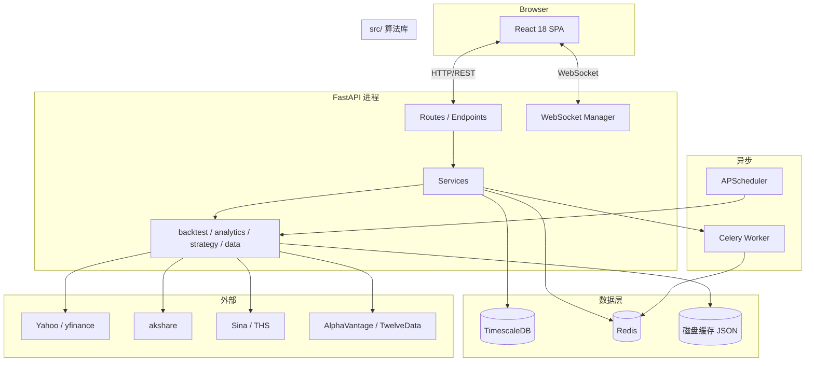
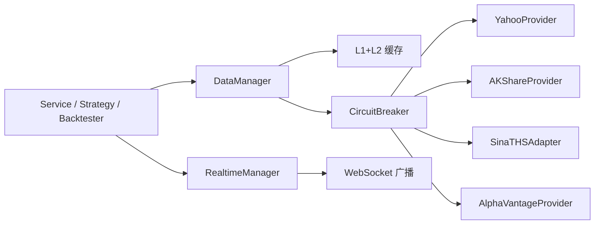
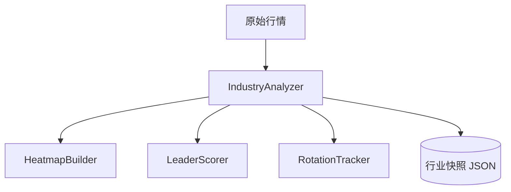
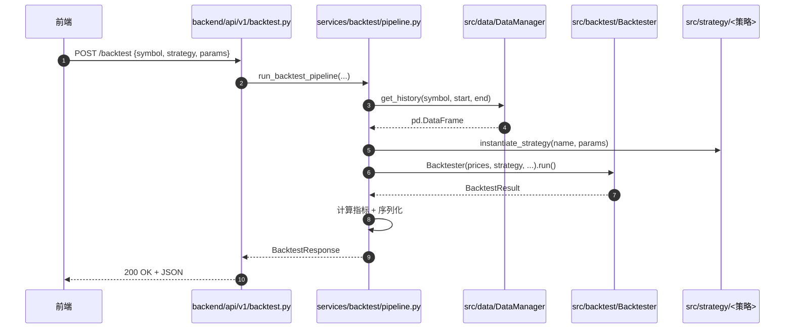

# 系统架构

> 面向新加入的工程师 / 二次开发者。先读这页,再读 [`PROJECT_STRUCTURE.md`](PROJECT_STRUCTURE.md) 了解目录,再读 [`API_REFERENCE.md`](API_REFERENCE.md) 了解接口。

---

## 1. 总体分层



---

## 2. 三层职责

| 层 | 路径 | 主职 | 不该做的事 |
|---|------|------|-----------|
| **Web 层** | `backend/app/api/` `backend/app/websocket/` | HTTP / WS 协议解析、参数校验、序列化、错误响应 | 业务计算、跨多个 model 的协调 |
| **Service 层** | `backend/app/services/` | 业务用例编排、跨 model 协调、事务边界、缓存策略 | 直接写 SQL、实现回测算法 |
| **算法库** | `src/` | 纯函数 / 类:回测、信号、估值、组合、报告 | 知道任何 HTTP / 用户 / DB 细节 |

> **判断方法**:`src/` 里任何模块应该可以脱离 `backend/` 在 Jupyter notebook 里直接 `import` 使用。

---

## 3. 关键模块

### 3.1 数据层 — `src/data/`



- `DataManager` 是统一入口,所有取数走这里
- 8 个 provider 走工厂模式,失败时按优先级回退
- `RealtimeManager` 维护 WebSocket 订阅 + 多客户端广播
- 断路器(Phase 4)防止单 provider 雪崩拖垮全部数据流

### 3.2 回测层 — `src/backtest/`

```
Backtester                     # 单资产
  ├── ExecutionEngine          # 滑点 / 手续费 / 市场冲击
  ├── PositionSizer            # 仓位
  ├── RiskManager              # 止损 / 最大回撤 / 集中度
  └── PerformanceAnalyzer      # 指标聚合
BatchBacktester                # 多任务并行
CrossMarketBacktester          # 跨市场组合
PortfolioBacktester            # 组合优化驱动
WalkForwardAnalyzer            # 时间序列交叉验证
```

### 3.3 策略层 — `src/strategy/`

```
BaseStrategy (abstract)
  ├── 基础: MovingAverageCrossover, RSIStrategy, BollingerBands, BuyAndHold, TurtleTrading, MultiFactor
  ├── 高级: MeanReversion, Momentum, MACD, ATRStop, VWAP, Stochastic, Combined
  ├── 技术: Ichimoku, CCI, ParabolicSAR, MultiIndicatorFusion
  ├── 配对: PairTrading, MultiPairTrading
  ├── ML: RandomForestStrategy, LogisticRegressionStrategy, EnsembleStrategy
  ├── 情绪: SentimentStrategy, ContrarianSentiment
  └── 深度学习: LSTMStrategy, DeepLearningEnsemble
```

每个策略实现 `generate_signals(prices) -> pd.DataFrame[buy/sell]`。验证统一走 `StrategyValidator`。

### 3.4 行业分析层 — `src/analytics/industry_*`



- 热力图 / 排行 / 龙头 / 轮动 共用同一份预计算结果(`IndustryAnalyzer`)
- 中间结果落 `cache/industry_*.json`,在端点层再加一层端点级 LRU(Phase 5C 拆分后会清晰)

---

## 4. 数据流(以「主回测」为例)



---

## 5. 关键架构决策(ADR 摘要)

### ADR-001 选 FastAPI 而非 Django/Flask
**为何**:Pydantic 校验 + 自动 OpenAPI 文档 + 原生 async + 现代类型提示生态,适合"以 API 为中心"的研究型工具。
**取舍**:放弃 Django ORM/Admin,自己组装 SQLAlchemy + 简单后台。

### ADR-002 算法库 (`src/`) 与 Web 层 (`backend/`) 解耦
**为何**:研究者用 Jupyter 调研策略时不应背 FastAPI 依赖,且要支持未来"把 backtester 抽成 pip 包"的可能。
**取舍**:`src/` 不能 import `backend/`。Service 层负责"翻译"两边。

### ADR-003 TimescaleDB 而非纯 PostgreSQL
**为何**:行情天然是时序数据,hypertable + 自动分区让 5 年×3000 标的的明细能 O(秒) 级聚合查询。
**取舍**:增加部署依赖(Docker 镜像更大);TimescaleDB 的 OSS 版本不支持多节点。

### ADR-004 前端用 CRA + Antd 5 + 自管 Context
**为何**:研究工具不追求极致 bundle 大小;Antd 提供 80% 的组件;不引 Redux 减少认知负担。
**取舍**:CRA 已被官方"deprecated",Long-term 需迁移到 Vite。

### ADR-005 多 Provider 故障转移
**为何**:akshare/sina 是爬虫式 API,不可靠;单点故障会拖垮整个研究工作台。
**取舍**:数据源不一致时,以"最近成功的 provider"为准 → 极端情况下数据可能不是来自最权威源。

### ADR-006 Celery 而非纯 asyncio 任务队列
**为何**:回测可能跑几分钟到几小时,需要持久化、重试、并发限流;asyncio 任务进程崩溃就丢。
**取舍**:多一个 worker 进程要管;Celery 5 在 Python 3.13 下有少量兼容警告。

---

## 6. 失败模式(Failure Modes)

| 失败 | 表现 | 兜底 |
|------|------|------|
| akshare 网站改版 | provider 抛 ParseError | 断路器 5 次失败后开路,切到 sina |
| TimescaleDB 不可用 | 启动期 health check 失败 | 后端拒绝启动;降级到 SQLite fallback(`src/data/alt_data`) |
| Redis 不可用 | celery 任务积压 | 同步路径不受影响;异步接口返回 503 |
| 单个策略炸 | 主回测端点 500 | error_handler 包装为统一错误响应,不影响其他端点 |
| 前端 bundle 加载失败 | 白屏 | nginx fallback 到 `index.html`;React error boundary 显示重试按钮 |

---

## 7. 代码质量与质量门

| 工具 | 何时跑 | 配置 |
|------|--------|------|
| ruff (lint + format) | pre-commit + CI | `pyproject.toml [tool.ruff]` |
| black | 手动(`pre-commit run black --all-files`) | `pyproject.toml [tool.black]` |
| mypy | 手动(stage=manual)+ 重点模块 PR | `pyproject.toml [tool.mypy]` |
| bandit | pre-commit + CI | 仅 src/backend |
| pytest | CI + 本地 | tests/unit + tests/integration |
| pytest-benchmark | CI perf job | tests/integration/test_*_perf.py |
| Playwright | CI e2e job | tests/e2e/ |

---

## 8. 关键性能数字(实测/目标)

| 指标 | 当前 | 目标 |
|------|------|------|
| `pytest tests/unit -q` | ~40s | < 60s |
| 主回测端点 p95 | ~1.5s | < 2s (CI SLA) |
| 行业热力图(冷启动) | ~8s | < 4s (P1) |
| WS 单广播延迟 | ~50ms | < 100ms |

---

**最后更新**: 2026-05-02
